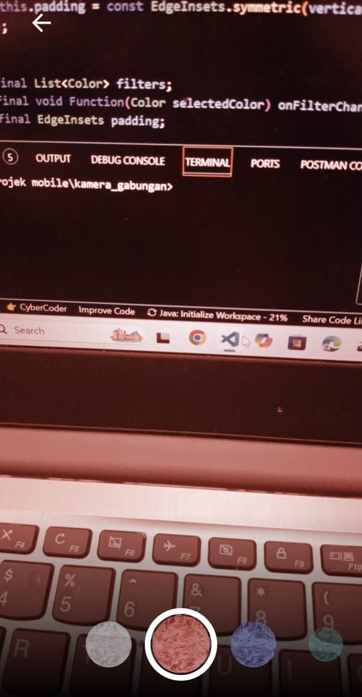

# kamera filter

1. Praktikum 1

    

   Ini adalah hasil praktikum 1, dimana praktikum 1 ini menampilkan layar kamera dan kemudian kamera tersebut bisa take gambar menggunakan button yang berada di samping bawah. Lalu di gambar kedua yaitu muncul display atau hasil take gambar.

   Praktikum 2

   

   Ini adalah hasil pratikum 2, dimana praktikum 2 ini membuat rangkaian pilihan filter agar terlihat lebih menarik dan filter ini bisa di swipe sesuai pilihan warna yang diinginkan.

2. Hasil gabungan praktikum 1 & 2

    
   
3. pada praktikum 1, Pada  void main() async berarti fungsi main dimulai dengan menggunakan kata kunci async, yang bisa menjalankan operasi yang membutuhkan waktu (misalnya mengambil daftar kamera yang tersedia) secara asinkron. Ini artinya kode akan menunggu hasil dari operasi yang ada di dalamnya sebelum melanjutkan ke langkah berikutnya, tanpa menghentikan proses lainnya. Di sini, await availableCameras() digunakan untuk mendapatkan daftar kamera yang tersedia di perangkat, yang membutuhkan waktu. Setelah itu, aplikasi akan dijalankan dengan runApp(), menggunakan kamera pertama yang ditemukan sebagai parameter untuk layar pengambilan gambar.
4. Anotasi @immutable dalam flutter digunakan untuk menandai bahwa sebuah class bersifat immutable, yang berarti bahwa nilai dari properti dalam class tersebut tidak boleh berubah setelah objeknya dibuat. Ini berguna untuk memastikan bahwa data tetap konsisten dan tidak berubah secara tidak sengaja, sehingga membantu dalam pengelolaan state yang lebih aman dan efisien. Biasanya, class yang diberi anotasi @immutable hanya boleh memiliki final properti, karena itu menandakan bahwa nilai hanya bisa diatur sekali, yaitu saat objek pertama kali dibuat. anotasi @immutable digunakan pada class PhotoFilterCarousel, FilterItem, dan FilterSelector. sedangkan Anotasi @override dalam flutter berfungsi untuk menunjukkan bahwa suatu metode atau properti dalam subclass menggantikan versi yang ada di superclass. Dengan adanya anotasi ini, flutter akan memeriksa apakah metode yang ditimpa memang ada di superclass, sehingga jika terjadi kesalahan penulisan atau perubahan pada struktur superclass, akan muncul peringatan atau error. 
